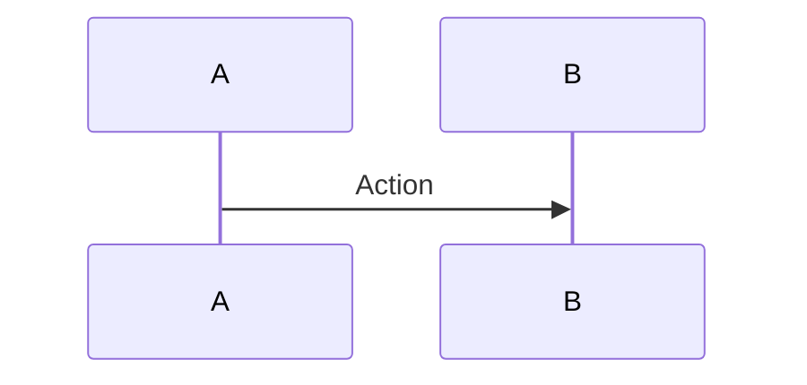

# 📚 TÓML HỢP TÀI LIỆU CHUẨN BỊ - GIAI ĐOẠN KIỂM TRA 24/03-25/03

## 🎯 Mục Đích

Tài liệu này giúp bạn chuẩn bị toàn diện cho giai đoạn **kiểm tra hệ thống microservice** từ thứ Ba 24/03 đến thứ Tư 25/03.

---

## 📦 CÁC TÀI LIỆU ĐÃ TẠO

### 1️⃣ **PREPARATION_GUIDE_24-25_MARCH.md** 
**📄 Tài liệu hướng dẫn chi tiết (30 trang)**

Nội dung:
- ✅ Mục tiêu của 4 giai đoạn kiểm tra
- ✅ **GIAI ĐOẠN 1** (Thứ Ba sáng): Kiểm tra project structure
  - Danh sách kiểm tra project
  - Các thư mục cần verify
  - Commands để kiểm tra build
  
- ✅ **GIAI ĐOẠN 2** (Thứ Ba chiều): Khởi động services
  - Quy trình theo từng bước
  - Cách chạy migrations
  - Kiểm tra health của mỗi service
  - Test API endpoints
  
- ✅ **GIAI ĐOẠN 3** (Thứ Tư sáng): Sinh sequence diagrams
  - Kiến trúc tổng quan
  - 4 flow chính cần document
  - Các flow khác
  - Cách export diagrams
  
- ✅ **GIAI ĐOẠN 4** (Thứ Tư chiều): Deploy
  - Pre-deployment checklist
  - Deployment steps chi tiết
  - Performance testing
  - Rollback plan

**Dùng cho**: Người dẫn dắt hoặc người cần hiểu chi tiết từng bước

---

### 2️⃣ **SEQUENCE_DIAGRAMS.md**
**📊 8 Sequence Diagrams sẵn sàng render (Mermaid format)**

Nội dung:
- ✅ **Flow #1**: Customer Registration & Login
- ✅ **Flow #2**: Browse Products & Add to Cart
- ✅ **Flow #3**: Checkout & Payment Processing
- ✅ **Flow #4**: Product Rating & Recommendations
- ✅ **Flow #5**: Order Status Tracking & Notifications
- ✅ **Flow #6**: Error Handling & Retry Logic
- ✅ **Flow #7**: Database Transaction Flow
- ✅ **Flow #8**: Overall Architecture / System Overview

Mỗi diagram có:


**Dùng cho**:
- Paste vào https://mermaid.live để render
- Export thành PNG cho presentation
- Include vào tài liệu dự án
- Dùng để giải thích cho stakeholders

---

### 3️⃣ **DAILY_CHECKLIST_24-25_MARCH.txt**
**✅ Checklist thực thi hàng ngày (In ra sử dụng)**

Nội dung:
- ✅ Từng ô checkbox ** **để đánh dấu
- ✅ Thời gian cụ thể cho mỗi task
- ✅ Expected results để so sánh
- ✅ Troubleshooting nhanh
- ✅ Sign-off form ở cuối

Dùng cách:
1. **In ra** 2 bản (sáng + chiều)
2. Dán lên bàn làm việc
3. **Tích từng ô** khi hoàn thành
4. Ghi lại kết quả thực tế
5. Ký tên ở cuối ngày

**Format**: Dễ in (A4 landscape hoặc portrait)

---

### 4️⃣ **QUICK_REFERENCE_CARD.txt**
**🚀 Commands reference nhanh (1-2 trang)**

Nội dung:
- ✅ Lệnh cho mỗi giai đoạn
- ✅ Emergency troubleshooting
- ✅ Services & Ports table
- ✅ Expected results checklist
- ✅ Sign-off area

Dùng cách:
1. In ra và dán vào bàn viết
2. Khi cần lệnh → tìm nhanh
3. Dùng QR code (nếu có) để link đến docs
4. Keep at desk throughout testing

---

## 🗂️ CẤU TRÚC FOLDER

Tất cả files lưu tại: `/reports/`

```
/reports/
├── PREPARATION_GUIDE_24-25_MARCH.md          [Main guide, 30 pages]
├── SEQUENCE_DIAGRAMS.md                       [8 diagrams + rendering guide]
├── DAILY_CHECKLIST_24-25_MARCH.txt            [Daily use, print out]
├── QUICK_REFERENCE_CARD.txt                   [Quick lookup, 1-2 pages]
├── DOCUMENT_SUMMARY.md                        [This file]
├── diagrams/                                  [Output folder for PNG files]
│   ├── diagram-1-auth.png
│   ├── diagram-2-cart.png
│   ├── diagram-3-payment.png
│   ├── diagram-4-recommendations.png
│   ├── diagram-5-tracking.png
│   ├── diagram-6-error-handling.png
│   ├── diagram-7-transactions.png
│   └── diagram-8-architecture.png
├── PHASE1_PROJECT_VERIFICATION.txt            [Generated after Phase 1]
├── PHASE2_SERVICES_VERIFICATION.txt           [Generated after Phase 2]
├── PHASE3_SEQUENCE_DIAGRAMS.txt               [Generated after Phase 3]
└── PHASE4_DEPLOYMENT_REPORT.txt               [Generated after Phase 4]
```

---

## 🎯 HƯỚNG DẪN SỬ DỤNG

### 📅 Thứ Ba 24/03

#### **Sáng (7:00 - 12:00) - GIAI ĐOẠN 1**
1. **Mở file**: `PREPARATION_GUIDE_24-25_MARCH.md` → Section "GIAI ĐOẠN 1"
2. **Dùng**: `DAILY_CHECKLIST_24-25_MARCH.txt` → "THỨ BA - SÁNG"
3. **Tham khảo nhanh**: `QUICK_REFERENCE_CARD.txt` → "GIAI ĐOẠN 1"
4. **Kết quả**: Lưu vào `PHASE1_PROJECT_VERIFICATION.txt`

#### **Chiều (13:00 - 18:00) - GIAI ĐOẠN 2**
1. **Follow**: Checklist "THỨ BA - CHIỀU"
2. **Chạy migrations**: Copy commands từ `QUICK_REFERENCE_CARD.txt`
3. **Test APIs**: Dùng curl commands từ guide
4. **Ghi lại**: Tất cả kết quả vào checklist
5. **Kết quả**: Lưu vào `PHASE2_SERVICES_VERIFICATION.txt`

---

### 📅 Thứ Tư 25/03

#### **Sáng (7:00 - 12:00) - GIAI ĐOẠN 3**
1. **Mở**: `SEQUENCE_DIAGRAMS.md`
2. **Render** mỗi diagram:
   - Copy code vào https://mermaid.live
   - Click "Export" → "Save as PNG"
   - Lưu vào `/reports/diagrams/`
3. **Xong**: 8 PNG files trong diagrams folder
4. **Kết quả**: Lưu vào `PHASE3_SEQUENCE_DIAGRAMS.txt`

#### **Chiều (13:00 - 18:00) - GIAI ĐOẠN 4**
1. **Follow**: Checklist "THỨ TƯ - CHIỀU"
2. **Functional tests**: Chạy 8 test scenarios
3. **Load test**: Chạy `load-test.ps1`
4. **Performance**:  Check metrics (latency, throughput, errors)
5. **Verification**: Tick all boxes trước khi sign off
6. **Kết quả**: Lưu vào `PHASE4_DEPLOYMENT_REPORT.txt`

---

## ✅ CHECKLIST TRƯỚC KHI BẮT ĐẦU

- [ ] Docker Desktop đang chạy
- [ ] Terminal/PowerShell ready
- [ ] `cd /path/to/book-microservice-que-master`
- [ ] In 2 bản `DAILY_CHECKLIST_24-25_MARCH.txt`
- [ ] In 1 bản `QUICK_REFERENCE_CARD.txt`
- [ ] Mở browser tab: https://mermaid.live
- [ ] Lưu SEQUENCE_DIAGRAMS.md để dễ copy
- [ ] Có pen/marker để tích checklist

---

## 🔧 HOW TO USE EACH FILE

### **File 1: PREPARATION_GUIDE (chi tiết)**
```
├─ Đọc: Trước khi làm mỗi giai đoạn
├─ Copy: Commands từ file này
├─ Reference: Xem ở bên trái màn hình
└─ Output: Tạo PHASE1-4 files từ templates
```

### **File 2: SEQUENCE_DIAGRAMS (render)**
```
├─ Copy: Từng block mermaid code
├─ Paste: Vào https://mermaid.live
├─ Export: Save thành PNG
├─ Use: Thêm vào slides/docs
└─ Store: Tất cả PNGs trong /diagrams/
```

### **File 3: DAILY_CHECKLIST (in + dùng)**
```
├─ In: Cả 2 ngày
├─ Tích: Mỗi ô khi xong
├─ Ghi: Actual results vào ô trống
├─ Monitor: Thời gian theo schedule
└─ Sign: Tên + ngày ở cuối
```

### **File 4: QUICK_REFERENCE (nhanh)**
```
├─ In: Để bàn làm việc
├─ Lookup: Cần lệnh → tìm nhanh
├─ Copy: Commands vào terminal
├─ Reference: 24/7 trong 2 ngày
└─ Store: Keep after testing
```

---

## 📊 METRICS TO TRACK

Khi hoàn thành, bạn sẽ có:

```
NGÀY 1 (24/03):
┌─────────────────────────────────────┐
│ ✅ Project Structure Verified       │
│ ✅ 12 Docker Images Built           │
│ ✅ 13 Services Deployed             │
│ ✅ 11 Migrations Applied            │
│ ✅ 11 APIs Responding (200 OK)      │
└─────────────────────────────────────┘

NGÀY 2 (25/03):
┌─────────────────────────────────────┐
│ ✅ 8 Sequence Diagrams Created      │
│ ✅ 8 PNG Exports Ready              │
│ ✅ 8 Functional Tests Passed        │
│ ✅ Load Test (0% error rate)        │
│ ✅ Performance Metrics OK            │
│ ✅ All Logs Reviewed                │
│ ✅ Documentation Complete           │
└─────────────────────────────────────┘

FINAL STATUS: ✅✅✅ PRODUCTION READY ✅✅✅
```

---

## 🆘 TROUBLESHOOTING GUIDE

### Common Issues

| Issue | Solution File | Command |
|-------|-->|---|
| Services won't start | QUICK_REFERENCE → Emergency | `docker compose down -v` |
| Port already in use | PREPARATION_GUIDE → Section 4.3 | `lsof -i :8000` |
| Migration fails | DAILY_CHECKLIST → detailed | Check logs |
| Mermaid won't render | SEQUENCE_DIAGRAMS → Section 3 | Paste in mermaid.live |

---

## 🎓 KEY LEARNINGS

Sau 2 ngày kiểm tra, bạn sẽ hiểu:

1. **Project Structure**: 13 independent microservices
2. **Deployment**: Docker Compose orchestration
3. **Database**: PostgreSQL multi-database setup
4. **Architecture**: Service-to-service communication
5. **Flows**: 8 key business flows documented
6. **Performance**: Baseline metrics established
7. **Documentation**: Complete diagrams for handoff

---

## 📞 CONTACT & SUPPORT

Nếu gặp vấn đề:
1. **Check**: QUICK_REFERENCE_CARD.txt troubleshooting section
2. **Read**: PREPARATION_GUIDE relevant section
3. **Search**: Error message in document's troubleshooting table
4. **Ask**: Team lead hoặc technical expert

---

## 📝 SIGN-OFF TEMPLATE

Sau khi hoàn thành tất cả 4 giai đoạn:

```
═════════════════════════════════════════════════
         KẾT LUẬN KIỂM TRA 24/03-25/03
═════════════════════════════════════════════════

Phase 1 - Project Creation: ✅ PASSED
Phase 2 - Service Deployment: ✅ PASSED
Phase 3 - Sequence Diagrams: ✅ PASSED
Phase 4 - Final Deploy: ✅ PASSED

Overall Status: ✅ PRODUCTION READY

Reviewer: _________________________
Date: _____________ Time: _________
Signature: _______________________
```

---

## 📚 REFERENCES

- **Docker Docs**: https://docs.docker.com/compose/
- **PostgreSQL**: https://www.postgresql.org/docs/
- **Django**: https://docs.djangoproject.com/
- **Mermaid**: https://mermaid.live/
- **RabbitMQ**: https://www.rabbitmq.com/

---

**Created**: 23/03/2025
**For**: Microservice Verification Phase (24/03-25/03)
**Version**: 1.0
**Status**: Ready for Use ✅

**Total Documents**: 4 guides + 8 diagrams = 12 deliverables
**Total Pages**: ~50+ pages documentation
**Estimated Time**: 16 hours over 2 days

---

## 🎯 NEXT STEPS

1. **Download**: Tất cả 4 files từ `/reports/`
2. **Print**: DAILY_CHECKLIST + QUICK_REFERENCE
3. **Read**: PREPARATION_GUIDE để familiarize
4. **Schedule**: Mark calendar 24/03-25/03
5. **Execute**: Follow checklist theo schedule
6. **Document**: Ghi lại actual results
7. **Sign off**: Ký tên khi hoàn thành

---

**Ready? Let's go! 🚀**

**Hôm nay 24/03 sáng 7h00 - Bắt đầu GIAI ĐOẠN 1 ngay!**
