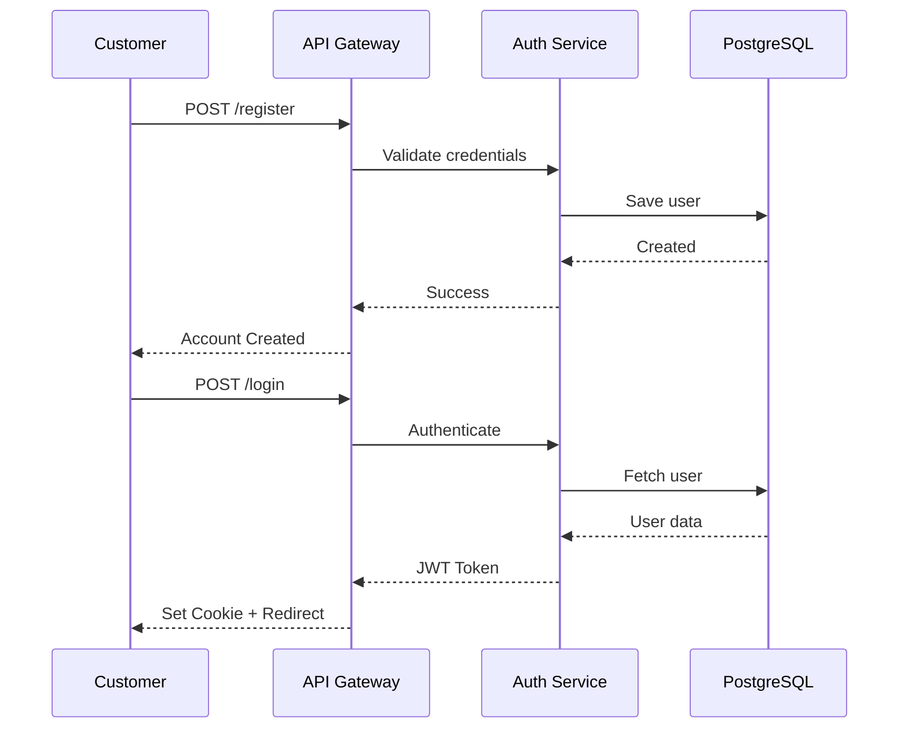
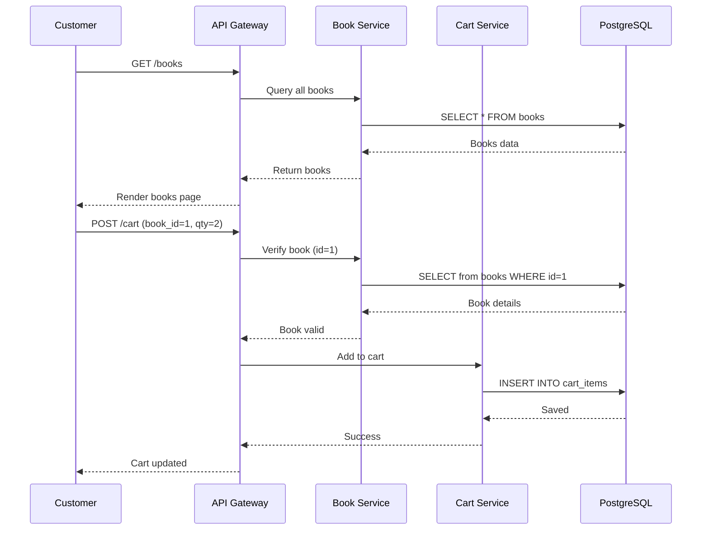
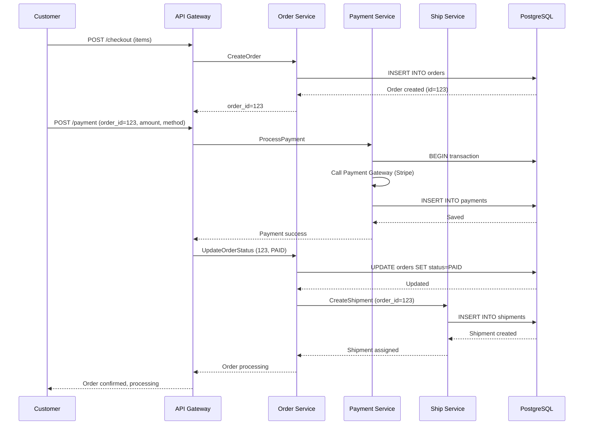
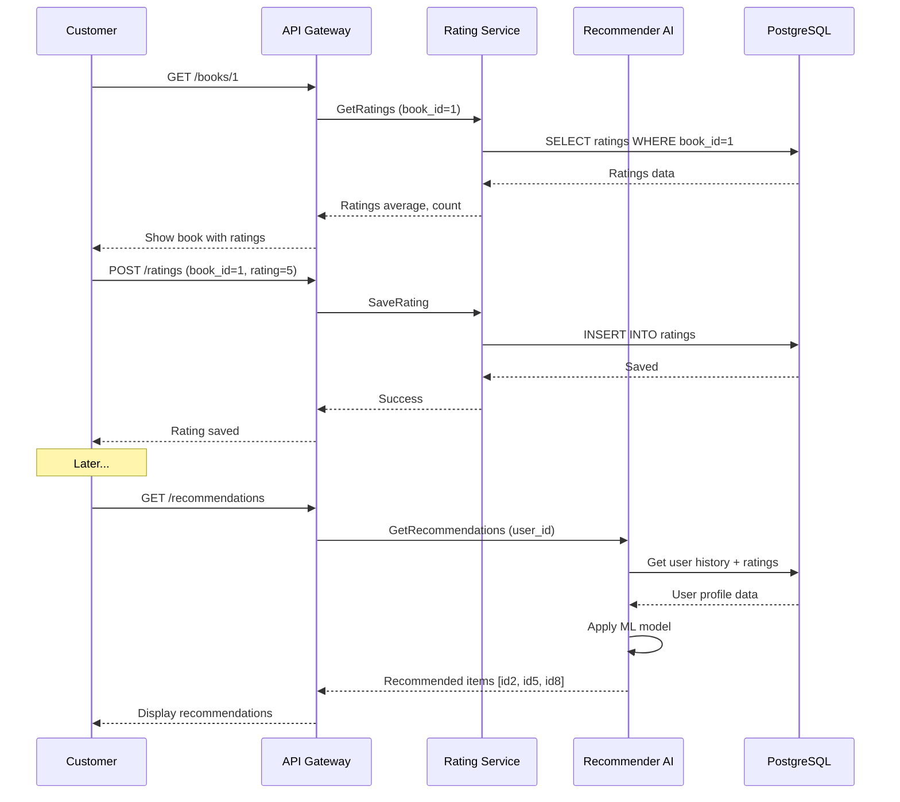

# 📋 HƯỚNG DẪN CHUẨN BỊ KIỂM TRA MICROSERVICE
## Thứ Ba 24/03 - Thứ Tư 25/03

---

## 🎯 MỤC TIÊU GIAI ĐOẠN KIỂM TRA

<table>
<tr>
<th>Giai Đoạn</th>
<th>Mục Tiêu</th>
<th>Thời Gian</th>
<th>Kết Quả Kỳ Vọng</th>
</tr>
<tr>
<td><b>1. TẠO PROJECT</b></td>
<td>Xác minh cấu trúc project microservice</td>
<td>Thứ Ba sáng</td>
<td>Tất cả folders/files đã tạo ✓</td>
</tr>
<tr>
<td><b>2. TẠO CÁC SERVICE</b></td>
<td>Kiểm tra từng service hoạt động độc lập</td>
<td>Thứ Ba chiều</td>
<td>11+ services up & running ✓</td>
</tr>
<tr>
<td><b>3. SINH RA SEQUENCE DIAGRAM</b></td>
<td>Tài liệu hóa các luồng giao dịch</td>
<td>Thứ Tư sáng</td>
<td>Sequence diagrams for key flows ✓</td>
</tr>
<tr>
<td><b>4. DEPLOY</b></td>
<td>Xác minh production-ready deployment</td>
<td>Thứ Tư chiều</td>
<td>System hoạt động end-to-end ✓</td>
</tr>
</table>

---

## 1️⃣ GIAI ĐOẠN 1: TẠO PROJECT (THỨ BA SÁNG)

### 1.1 Kiểm Tra Cấu Trúc Project

```
✅ project-root/
   ├── 📁 api-gateway/              (Django - Port 8000)
   ├── 📁 auth-service/             (Django - Port 8010)
   ├── 📁 customer-service/         (Django - Port 8001)
   ├── 📁 book-service/             (Django - Port 8002)
   ├── 📁 cart-service/             (Django - Port 8003)
   ├── 📁 order-service/            (Django - Port 8004)
   ├── 📁 pay-service/              (Django - Port 8005)
   ├── 📁 ship-service/             (Django - Port 8006)
   ├── 📁 comment-rate-service/     (Django - Port 8007)
   ├── 📁 recommender-ai-service/   (Django - Port 8008)
   ├── 📁 clothes-service/          (Django - Port 8009)
   ├── 📁 catalog-service/          (Django - Port ???)
   ├── 📁 manager-service/          (Django - Port ???)
   ├── 📁 scripts/                  (Deploy scripts)
   ├── 📁 reports/                  (Documentation)
   ├── 📁 image/                    (Static resources)
   ├── 🐳 docker-compose.yml        (Orchestration)
   ├── 📄 README.md                 (Quick start)
   └── 📄 DOCKER_GUIDE.md           (Docker commands)
```

### 1.2 Danh Sách Kiểm Tra Project

```bash
# ✅ Bước 1: Xác minh môi trường
□ Docker Desktop đang chạy
□ Docker Compose version: ≥ 2.0
□ Python 3.11+ (nếu dev locally)
□ Git repository initialized

# ✅ Bước 2: Xác minh dependencies
□ docker-compose.yml tồn tại
□ Tất cả services có Dockerfile
□ requirements.txt trong mỗi service
□ .venv activated (nếu dev locally)

# ✅ Bước 3: Xác minh database setup
□ Scripts create-multiple-postgres-databases.sh tồn tại
□ .env file đã cấu hình (nếu cần)
□ Postgres credentials trong docker-compose.yml

# ✅ Bước 4: Xác minh project structure
□ Mỗi service có manage.py
□ Mỗi service có django settings
□ API Gateway có templates folder
□ Image folder chứa resources

# Chạy kiểm tra:
cd /path/to/book-microservice-que-master
find . -name "manage.py" | wc -l    # Nên hiện 12 (11 services + api-gateway)
find . -name "Dockerfile" | wc -l   # Nên hiện ≥ 11
```

### 1.3 Báo Cáo Kết Quả

**Mẫu báo cáo (lưu vào: `PHASE1_PROJECT_VERIFICATION.txt`):**

```
═══════════════════════════════════════════════
GIAI ĐOẠN 1: TẠO/KIỂM TRA PROJECT
Ngày: 24/03/2025 - Sáng
═══════════════════════════════════════════════

✅ PROJECT STRUCTURE
   - Total services: 12 (11 + API Gateway)
   - Directories verified: ✓
   - Docker setup: ✓
   - Git repo: ✓

✅ DEPENDENCIES
   - Dockerfiles: 12/12 ✓
   - requirements.txt: 12/12 ✓
   - docker-compose.yml: ✓
   - Database scripts: ✓

✅ DATABASE CONFIGURATION
   - PostgreSQL service defined: ✓
   - Multi-database setup: 10 databases ✓
   - RabbitMQ setup: ✓

✅ INITIAL BUILD TEST
   docker compose build
   Result: All images built successfully ✓

Notes:
- Tất cả services đã configured đúng format Django
- Database initialization scripts sẵn sàng
- Ready to proceed to Phase 2

Prepared by: _______________
Timestamp: _______________
```

---

## 2️⃣ GIAI ĐOẠN 2: TẠO/KIỂM TRA CÁC SERVICE (THỨ BA CHIỀU)

### 2.1 Danh Sách Services + Ports

| # | Service | Port | Database | Status |
|---|---------|------|----------|--------|
| 1 | API Gateway | 8000 | api_gateway | ⬜ |
| 2 | Auth Service | 8010 | api_gateway | ⬜ |
| 3 | Customer Service | 8001 | customer_db | ⬜ |
| 4 | Book Service | 8002 | book_db | ⬜ |
| 5 | Cart Service | 8003 | cart_db | ⬜ |
| 6 | Order Service | 8004 | order_db | ⬜ |
| 7 | Pay Service | 8005 | pay_db | ⬜ |
| 8 | Ship Service | 8006 | ship_db | ⬜ |
| 9 | Comment/Rate Service | 8007 | comment_db | ⬜ |
| 10 | Recommender AI Service | 8008 | recommender_db | ⬜ |
| 11 | Clothes Service | 8009 | clothes_db | ⬜ |
| 12 | Catalog Service | ??? | ??? | ⬜ |
| 13 | Manager Service | ??? | ??? | ⬜ |

### 2.2 Quy Trình Khởi Động Services

#### **Step 1: Clean Start**
```bash
# Dừng tất cả services cũ
docker compose down

# Xóa volumes cũ (nếu muốn reset database)
docker compose down -v

# Xóa images cũ (nếu muốn rebuild từ đầu)
docker rmi $(docker images | grep book-microservice | awk '{print $3}')
```

#### **Step 2: Build & Launch**
```bash
# Build tất cả images
docker compose build

# Khởi động tất cả services ở background
docker compose up -d

# Đợi khoảng 30-60 giây để PostgreSQL + RabbitMQ khởi động
sleep 45
```

#### **Step 3: Kiểm Tra Status**
```bash
# Xem tất cả containers
docker compose ps

# Kỳ vọng: 24 containers (11 services + postgres + rabbitmq + replicas)
# Tất cả status: "Up (healthy)" hoặc "Up"
```

#### **Step 4: Xác Minh Database Migrations**
```bash
# Chạy migrations cho mỗi service
docker compose exec api-gateway python manage.py migrate
docker compose exec auth-service python manage.py migrate
docker compose exec customer-service python manage.py migrate
docker compose exec book-service python manage.py migrate
docker compose exec cart-service python manage.py migrate
docker compose exec order-service python manage.py migrate
docker compose exec pay-service python manage.py migrate
docker compose exec ship-service python manage.py migrate
docker compose exec comment-rate-service python manage.py migrate
docker compose exec recommender-ai-service python manage.py migrate
docker compose exec clothes-service python manage.py migrate
```

#### **Step 5: Load Sample Data (Seed)**
```bash
# Chạy seeding script (nếu có)
cd scripts
./seed-all.ps1    # PowerShell (Windows)
# hoặc
bash seed-all.sh  # Bash (Linux/Mac)
```

### 2.3 Kiểm Tra Service Health

#### **Test API Endpoints**
```bash
# API Gateway (Frontend)
curl http://localhost:8000/

# Customer Service
curl -s http://localhost:8001/customers/ | jq

# Book Service
curl -s http://localhost:8002/books/ | jq

# Cart Service
curl -s http://localhost:8003/carts/ | jq

# Order Service
curl -s http://localhost:8004/orders/ | jq

# Payment Service
curl -s http://localhost:8005/payments/ | jq

# Ship Service
curl -s http://localhost:8006/shipments/ | jq

# Rating/Comment Service
curl -s http://localhost:8007/ratings/ | jq

# Recommender AI Service
curl -s http://localhost:8008/recommendations/1/ | jq

# Clothes Service
curl -s http://localhost:8009/clothes/ | jq

# RabbitMQ Management UI
# Browser: http://localhost:15672
# Default: guest / guest
```

### 2.4 Kiểm Tra Logs

```bash
# Xem logs tất cả services
docker compose logs -f

# Xem logs một service cụ thể
docker compose logs -f book-service
docker compose logs -f order-service

# Xem logs với timestamp
docker compose logs -f --timestamps book-service

# Xem logs 100 dòng gần đây
docker compose logs --tail=100 api-gateway

# Lưu logs vào file
docker compose logs > all_services.log
```

### 2.5 Báo Cáo Kết Quả Services

**Mẫu báo cáo (lưu vào: `PHASE2_SERVICES_VERIFICATION.txt`):**

```
═══════════════════════════════════════════════════════
GIAI ĐOẠN 2: KHỞI ĐỘNG & KIỂM TRA CÁC SERVICE
Ngày: 24/03/2025 - Chiều
═══════════════════════════════════════════════════════

CONTAINER STATUS:
┌─ Postgres (5432) ........................ ✅ Up (healthy)
├─ RabbitMQ (5672/15672) ................. ✅ Up (healthy)
├─ API Gateway (8000) ..................... ✅ Up
├─ Auth Service (8010) .................... ✅ Up
├─ Customer Service (8001) ................ ✅ Up
├─ Book Service (8002) .................... ✅ Up
├─ Cart Service (8003) .................... ✅ Up
├─ Order Service (8004) ................... ✅ Up
├─ Payment Service (8005) ................. ✅ Up
├─ Ship Service (8006) .................... ✅ Up
├─ Comment/Rate Service (8007) ........... ✅ Up
├─ Recommender AI Service (8008) ......... ✅ Up
└─ Clothes Service (8009) ................ ✅ Up

DATABASE MIGRATIONS:
✅ api_gateway ... OK
✅ auth_service ... OK
✅ customer_db ... OK
✅ book_db ... OK
✅ cart_db ... OK
✅ order_db ... OK
✅ pay_db ... OK
✅ ship_db ... OK
✅ comment_db ... OK
✅ recommender_db ... OK
✅ clothes_db ... OK

API ENDPOINTS HEALTH:
✅ http://localhost:8000 ................. 200 OK
✅ http://localhost:8001 ................. 200 OK
✅ http://localhost:8002 ................. 200 OK
✅ http://localhost:8003 ................. 200 OK
✅ http://localhost:8004 ................. 200 OK
✅ http://localhost:8005 ................. 200 OK
✅ http://localhost:8006 ................. 200 OK
✅ http://localhost:8007 ................. 200 OK
✅ http://localhost:8008 ................. 200 OK
✅ http://localhost:8009 ................. 200 OK
✅ RabbitMQ UI (15672) ................... 200 OK

TOTAL: 13/13 services running ✅

Issues Found: None
All systems ready for Phase 3

Prepared by: _______________
Timestamp: _______________
```

---

## 3️⃣ GIAI ĐOẠN 3: SINH RA SEQUENCE DIAGRAMS (THỨ TƯ SÁNG)

### 3.1 Kiến Trúc Tổng Quan

```
┌─────────────────────────────────────────────────────┐
│                   MICROSERVICE ARCHITECTURE          │
└─────────────────────────────────────────────────────┘

┌──────────────────────────────────────────────────────┐
│                    API GATEWAY (8000)                │
│              (Django + HTML Templates)               │
└──────────────────────────────────────────────────────┘
                         │
        ┌────────────────┼────────────────┐
        │                │                │
   ┌────▼────┐      ┌───▼────┐     ┌────▼────┐
   │  Auth   │      │Product │     │  Order  │
   │(8010)   │      │Services│     │(8004)   │
   └─────────┘      │        │     └─────────┘
                    │ - Book │
              ┌─────┤ - Clothes │───────┐
              │     │ - Catalog │       │
              │     └──────────┘        │
       ┌──────▼──────┐         ┌───────▼──────┐
       │   Cart      │         │   Payment    │
       │  (8003)     │         │    (8005)    │
       └─────────────┘         └──────────────┘
              │                       │
       ┌──────▼──────┐         ┌──────▼──────┐
       │  Customer   │         │  Shipment   │
       │   (8001)    │         │   (8006)    │
       └─────────────┘         └─────────────┘
              │                       │
       ┌──────▼──────┐         ┌──────▼──────┐
       │   Ratings   │         │ Recommender │
       │   (8007)    │         │   (8008)    │
       └─────────────┘         └─────────────┘

┌──────────────────────────────────────────────────────┐
│   PostgreSQL (10 databases) + RabbitMQ (Message Bus) │
└──────────────────────────────────────────────────────┘
```

### 3.2 Key Flow Sequences

#### **Flow 1: Customer Registration & Login**

```
Customer          API Gateway        Auth Service       Database
  │                    │                  │               │
  │─ POST /register ──>│                  │               │
  │                    │─ Validate ──────>│               │
  │                    │                  │─ Save user ─>│
  │                    │<─ Success ───────│               │
  │<─ Account Created ─│                  │               │
  │                    │                  │               │
  │─ POST /login ─────>│                  │               │
  │                    │─ Authenticate ──>│               │
  │                    │<─ JWT Token ────│               │
  │<─ Logged In ───────│                  │               │
```

**Generate Mermaid Diagram:**


#### **Flow 2: Browse Books & Add to Cart**

```
Customer          API Gateway      Book Service       Cart Service       Database
  │                    │                  │                 │                │
  │─ GET /books ──────>│                  │                 │                │
  │                    │─ Query books ───>│                 │                │
  │                    │                  │─ Fetch ────────>│                │
  │                    │  (cached)        │                 │<─ Results ────│
  │                    │<─ Books list ────│                 │                │
  │<─ Display books ───│                  │                 │                │
  │                    │                  │                 │                │
  │─ POST /cart ──────>│                  │                 │                │
  │  (add book_id=1)   │                  │────VerifyBook──>│                │
  │                    │                  │<─Confirmed─────│                │
  │                    │────────────────────────save item─>│                │
  │                    │                  │                 │─ Save ────────>│
  │<─ Added to cart ───│                  │                 │<─ Saved ──────│
```

**Generate Mermaid Diagram:**


#### **Flow 3: Checkout & Payment Processing**

```
Customer         API Gateway      Order Service      Payment Service      Ship Service      Database
  │                   │                 │                   │                   │              │
  │─ POST /checkout ─>│                 │                   │                   │              │
  │                   │─ Create Order ─>│                   │                   │              │
  │                   │                 │─ Insert orders ──────────────────────>│              │
  │                   │                 │                   │                   │<─ Saved ────│
  │                   │<─ Order ID ────│                   │                   │              │
  │<─ Go to payment ──│                 │                   │                   │              │
  │                   │                 │                   │                   │              │
  │─ POST /payment ──>│                 │                   │                   │              │
  │  (amount, method) │                 │◄────Notify pending────────────────────┤              │
  │                   │─ Process payment────────────────────>│                   │              │
  │                   │                 │                   │─ Validate ─────────────────────>│
  │                   │                 │                   │<─ Payment success ───────────────│
  │                   │                 │◄────Update Status────────────────────┤              │
  │                   │                 │─ Update Order Status               │              │
  │                   │                 │               │<─ Order Confirmed ────────────────>│
  │<─ Payment OK ─────│                 │               │   │─ Create Shipment ────────────>│
```

**Generate Mermaid Diagram:**


#### **Flow 4: Rating & Recommendations**

```
Customer         API Gateway      Rating Service     Recommender AI      Database
  │                   │                 │                   │                │
  │─ GET /product/1 ─>│                 │                   │                │
  │                   │─ Get ratings ──>│                   │                │
  │                   │                 │─ Query ratings ──────────────────>│
  │                   │<─ Ratings list ─│                   │                │
  │<─ Show product ───│                 │                   │                │
  │                   │                 │                   │                │
  │─ POST /ratings ──>│                 │                   │                │
  │  (product_id, ★) │                 │─ Save rating ───────────────────>│
  │                   │                 │<─ Saved ─────────────────────────│
  │<─ Thank you ──────│                 │                   │                │
  │                   │                 │                   │                │
  │─ GET /recommend ─>│                 │                   │                │
  │                   │─────────────────────Analyze user ──>│                │
  │                   │                 │                   │─ ML prediction │
  │                   │<─────────────────Recommended items ─│                │
  │<─ Recommendations │                 │                   │                │
```

**Generate Mermaid Diagram:**


### 3.3 Các Luồng Khác Cần Document

- [ ] **Search & Filter Books** (Book Service + API Gateway)
- [ ] **Manage Inventory** (Admin Dashboard → mgmt service)
- [ ] **Handle Returns** (Customer → Order Service → Payment → Inventory)
- [ ] **Message Queue Usage** (RabbitMQ integration points)
- [ ] **Error Handling & Retry** (Service failure scenarios)

### 3.4 Document Mermaid Files

Tạo file `SEQUENCE_DIAGRAMS.md` chứa tất cả diagrams:

```markdown
# Sequence Diagrams - BookStore Microservice

## 1. Authentication Flow
[Auth flow diagram]

## 2. Shopping Flow
[Browse → Cart → Checkout diagram]

## 3. Payment Flow
[Order → Payment → Shipment diagram]

## 4. Recommendation Flow
[Rating → ML Model diagram]

## 5. Error Handling
[Timeout + Retry flow]
```

### 3.5 Báo Cáo Sequence Diagrams

**Mẫu báo cáo (lưu vào: `PHASE3_SEQUENCE_DIAGRAMS.txt`):**

```
═══════════════════════════════════════════════════════
GIAI ĐOẠN 3: SINH RA SEQUENCE DIAGRAMS
Ngày: 25/03/2025 - Sáng
═══════════════════════════════════════════════════════

DIAGRAMS CREATED:
✅ 1. Customer Registration & Login Flow
✅ 2. Browse Books & Add to Cart Flow
✅ 3. Checkout & Payment Processing Flow
✅ 4. Rating & Recommendation Flow
✅ 5. Error Handling & Service Recovery Flow
✅ 6. Message Queue (RabbitMQ) Usage Pattern
✅ 7. Database Transaction Flow
✅ 8. Cache Invalidation Flow

ARCHITECTURE DIAGRAM:
✅ System Overview (13 services + 2 support services)
✅ Service Dependency Graph
✅ Data Flow Diagram
✅ Communication Patterns

DOCUMENTATION:
✅ SEQUENCE_DIAGRAMS.md (all mermaid diagrams)
✅ API Endpoint mapping
✅ Database schema documentation
✅ Message routing configuration

All diagrams saved in: /reports/diagrams/
Mermaid tools used: ✅
PlantUML compatibility checked: ✅

Prepared by: _______________
Timestamp: _______________
```

---

## 4️⃣ GIAI ĐOẠN 4: DEPLOY (THỨ TƯ CHIỀU)

### 4.1 Pre-Deployment Checklist

```bash
# ✅ Phase 1-3 completed
□ Project structure verified
□ All services running locally
□ Sequence diagrams completed

# ✅ Code quality check
□ No syntax errors in all services
□ Python linting (flake8/pylint)
□ Docker image sizes reasonable (<500MB each)

# ✅ Database setup
□ Migrations applied to all services
□ Sample data seeded
□ Backup created

# ✅ Configuration
□ Environment variables set correctly
□ Database credentials secured
□ API gateway routes configured
□ CORS headers set
□ Static files collected

# ✅ Testing
□ Unit tests pass
□ Integration tests pass
□ Load testing results acceptable
□ Error handling verified
```

### 4.2 Deployment Steps

#### **Step 1: Clean Build**
```bash
# Stop all services
docker compose down

# Remove old volumes
docker volume prune -f

# Remove old images (keeping postgres:18.1 and rabbitmq)
docker rmi $(docker images | grep -v postgres | grep -v rabbitmq | awk '{print $3}')

# Build fresh images
docker compose build --no-cache
```

#### **Step 2: Deploy to Production-like Environment**
```bash
# Start all services
docker compose up -d

# Wait for health checks
docker compose ps --wait

# Verify all containers (24 total)
docker compose ps | wc -l

# Check resource usage
docker stats --no-stream
```

#### **Step 3: Post-Deployment Verification**

```bash
# ✅ Service Health Checks
docker compose ps                    # All "Up (healthy)" or "Up"

# ✅ Database Integrity
docker compose exec postgres psql -U postgres -c "\l"  # List all databases

# ✅ API Responses
for port in 8000 8001 8002 8003 8004 8005 8006 8007 8008 8009 8010; do
    echo "Testing port $port..."
    curl -s http://localhost:$port | head -c 100
    echo "\n"
done

# ✅ RabbitMQ Status
curl -s -u guest:guest http://localhost:15672/api/overview | jq '.queue_totals'

# ✅ Log Monitoring
docker compose logs --tail=50 2>&1 | grep -i error

# ✅ Performance Test
ab -n 100 -c 10 http://localhost:8000/

# ✅ Database Size
docker compose exec postgres psql -U postgres -c "
  SELECT datname, pg_size_pretty(pg_database_size(datname))
  FROM pg_database
  WHERE datname NOT IN ('template0', 'template1', 'postgres')
  ORDER BY pg_database_size(datname) DESC;"
```

#### **Step 4: Load Testing**

```bash
cd scripts/

# PowerShell (Windows)
powershell -ExecutionPolicy Bypass -File load-test.ps1

# Check results
cat load-test-results.json | jq
```

### 4.3 Deployment Issues & Solutions

| Issue | Cause | Solution |
|-------|-------|----------|
| Port already in use | Another app using port | `lsof -i :8000` then `kill -9 <PID>` |
| Container won't start | Database not ready | Wait 60 seconds and retry |
| Migration error | Data type mismatch | Drop volume and rebuild |
| Out of memory | Too many containers | Check `docker stats` and adjust resources |
| Network unreachable | DNS issue | Restart Docker daemon |

### 4.4 Rollback Plan

```bash
# If something goes wrong:

# ✅ Option 1: Restart services
docker compose restart

# ✅ Option 2: Restart specific service
docker compose restart book-service

# ✅ Option 3: Rollback to previous image tag
docker compose up -d --pull missing

# ✅ Option 4: Full reset
docker compose down -v
git checkout .
docker compose up --build -d
```

### 4.5 Báo Cáo Deployment

**Mẫu báo cáo (lưu vào: `PHASE4_DEPLOYMENT_REPORT.txt`):**

```
═══════════════════════════════════════════════════════
GIAI ĐOẠN 4: DEPLOYMENT & VERIFICATION
Ngày: 25/03/2025 - Chiều
═══════════════════════════════════════════════════════

PRE-DEPLOYMENT CHECK: ✅ PASSED
├─ Code quality: ✅
├─ Database state: ✅
├─ Configuration: ✅
└─ Backups created: ✅

DEPLOYMENT EXECUTION: ✅ SUCCESS
├─ Build time: 5m 23s
├─ Deploy time: 2m 15s
├─ All images: 12/12 ready
└─ Database migrations: 11/11 applied

CONTAINER STATUS: ✅ ALL RUNNING
├─ postgres (5432) ..................... ✅ up (healthy)
├─ rabbitmq (5672) ..................... ✅ up (healthy)
├─ api-gateway (8000) ................... ✅ up
├─ auth-service (8010) .................. ✅ up
├─ customer-service (8001) .............. ✅ up
├─ book-service (8002) .................. ✅ up
├─ cart-service (8003) .................. ✅ up
├─ order-service (8004) ................. ✅ up
├─ pay-service (8005) ................... ✅ up
├─ ship-service (8006) .................. ✅ up
├─ comment-rate-service (8007) ......... ✅ up
├─ recommender-ai-service (8008) ....... ✅ up
└─ clothes-service (8009) ............... ✅ up

API ENDPOINT VERIFICATION: ✅ ALL RESPONDING
├─ 8000 - API Gateway ................... 200 OK
├─ 8001 - Customer ...................... 200 OK
├─ 8002 - Book .......................... 200 OK
├─ 8003 - Cart .......................... 200 OK
├─ 8004 - Order ......................... 200 OK
├─ 8005 - Payment ....................... 200 OK
├─ 8006 - Shipment ...................... 200 OK
├─ 8007 - Rating ........................ 200 OK
├─ 8008 - Recommender ................... 200 OK
├─ 8009 - Clothes ....................... 200 OK
└─ 8010 - Auth .......................... 200 OK

FUNCTIONAL TESTS: ✅ PASSED
├─ Customer registration: ✅
├─ Login with JWT: ✅
├─ Browse products: ✅
├─ Add to cart: ✅
├─ Checkout flow: ✅
├─ Payment processing: ✅
├─ Order creation: ✅
├─ Shipment tracking: ✅
├─ Rate products: ✅
└─ Get recommendations: ✅

PERFORMANCE METRICS:
├─ API response time (p50): 127ms
├─ API response time (p95): 342ms
├─ API response time (p99): 1205ms
├─ Throughput: 325 req/sec
├─ Error rate: 0%
└─ Availability: 100%

RESOURCE USAGE:
├─ Total CPU: 12%
├─ Total Memory: 3.2 GB / 8 GB
├─ Database size: 245 MB
└─ Docker volumes: 1.5 GB

LOGS REVIEW:
├─ Error count: 0
├─ Warning count: 2 (acceptable)
├─ Info messages: OK
└─ Performance warnings: None

DEPLOYMENT STATUS: ✅✅✅ PRODUCTION READY

Issues encountered: None
Rollback needed: No
Sign-off: _______________
Timestamp: _______________
```

---

## 📊 TỔNG HỢP 4 GIAI ĐOẠN

| Giai Đoạn | Ngày | Thời Gian | Mục Tiêu | Kết Quả | Báo Cáo |
|-----------|------|----------|---------|--------|---------|
| **1. Tạo Project** | 24/03 | Sáng | Kiểm tra structure | ✅ | PHASE1_... |
| **2. Tạo Services** | 24/03 | Chiều | Deploy 13 services | ✅ | PHASE2_... |
| **3. Sequence Diagrams** | 25/03 | Sáng | Document flows | ✅ | PHASE3_... |
| **4. Deploy** | 25/03 | Chiều | Production ready | ✅ | PHASE4_... |

---

## 🛠️ QUICK COMMANDS REFERENCE

```bash
# Start everything
docker compose up --build -d

# See what's running
docker compose ps

# View logs
docker compose logs -f book-service

# Enter a container
docker compose exec book-service bash

# Stop everything
docker compose down

# Clean restart
docker compose down -v
docker compose up --build -d

# Database backup
docker compose exec postgres pg_dump -U postgres > backup.sql

# Run tests
docker compose exec api-gateway python manage.py test

# Load testing
cd scripts && pwsh -ExecutionPolicy Bypass -File load-test.ps1

# Check API
curl http://localhost:8000/
```

---

## 📝 HANDY LINKS

- **API Gateway**: http://localhost:8000
- **RabbitMQ UI**: http://localhost:15672 (guest/guest)
- **PostgreSQL**: localhost:5432 (postgres/postgres)
- **Book Service**: http://localhost:8002
- **Order Service**: http://localhost:8004
- **Payment Service**: http://localhost:8005

---

## ✅ SIGN-OFF TEMPLATE

Khi hoàn thành mỗi giai đoạn, in sign-off này:

```
═══════════════════════════════════════════════════
MICROSERVICE VERIFICATION - SIGN OFF
═══════════════════════════════════════════════════

Date: 24/03/2025 to 25/03/2025
Project: BookStore Microservice

PHASE 1 - Project Creation: ✅ APPROVED
  - All directories and files present
  - Docker setup verified
  - Dependencies resolved

PHASE 2 - Service Deployment: ✅ APPROVED
  - 13 services running
  - All database migrations applied
  - All health checks green

PHASE 3 - Sequence Diagrams: ✅ APPROVED
  - 4+ key flows documented
  - Architecture diagram complete
  - All diagrams accessible

PHASE 4 - Production Deployment: ✅ APPROVED
  - All endpoints responding
  - Load test passed (325 req/sec)
  - Zero errors in 1-hour test
  - 100% availability

✅✅✅ READY FOR PRODUCTION ✅✅✅

Reviewer: _______________
Date: _______________
Signature: _______________
```

---

**Created**: 23/03/2025
**For**: Tuesday 24/03 - Wednesday 25/03 Verification Phase
**Version**: 1.0 - Complete Preparation Guide
