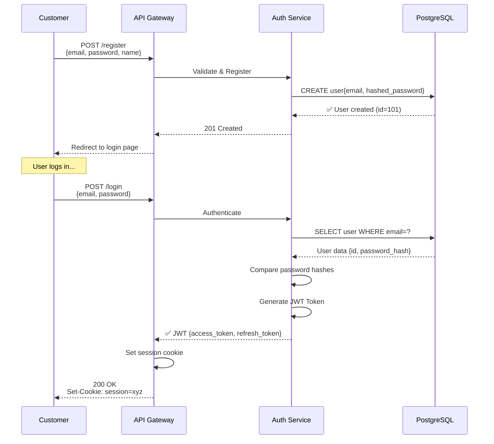
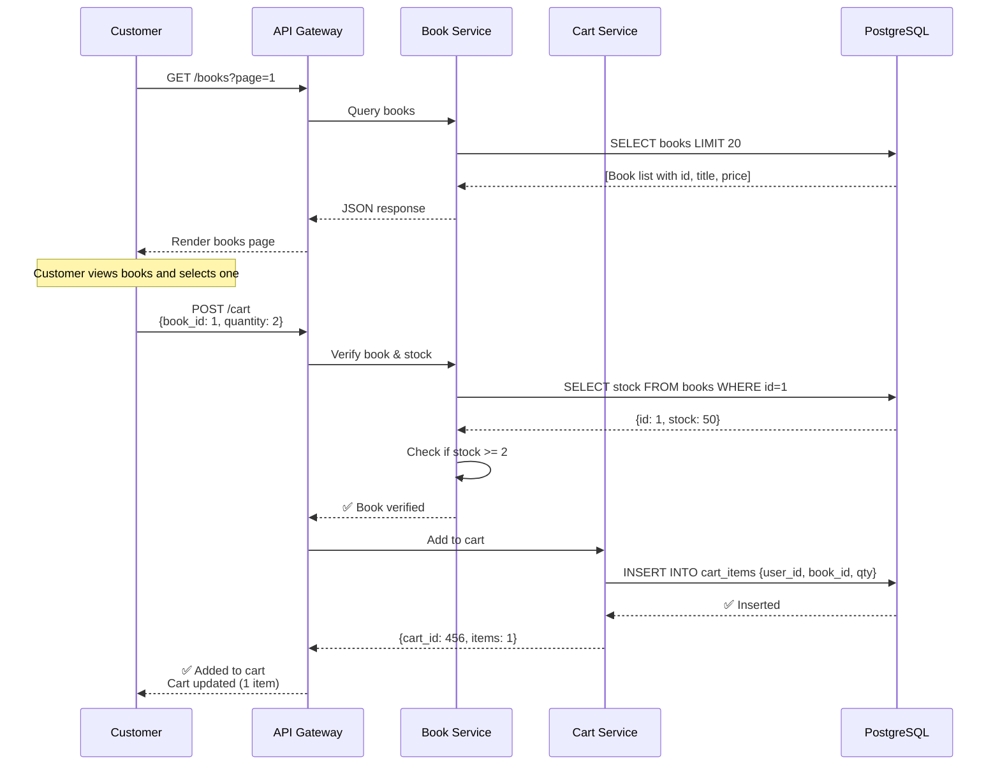
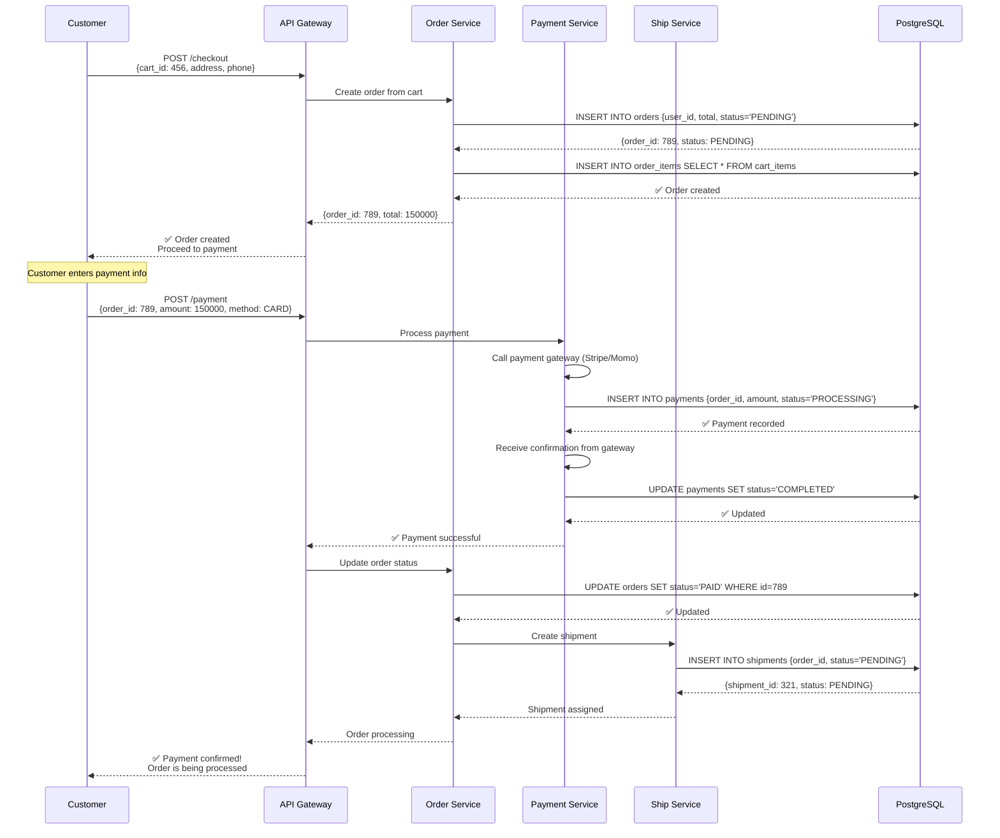
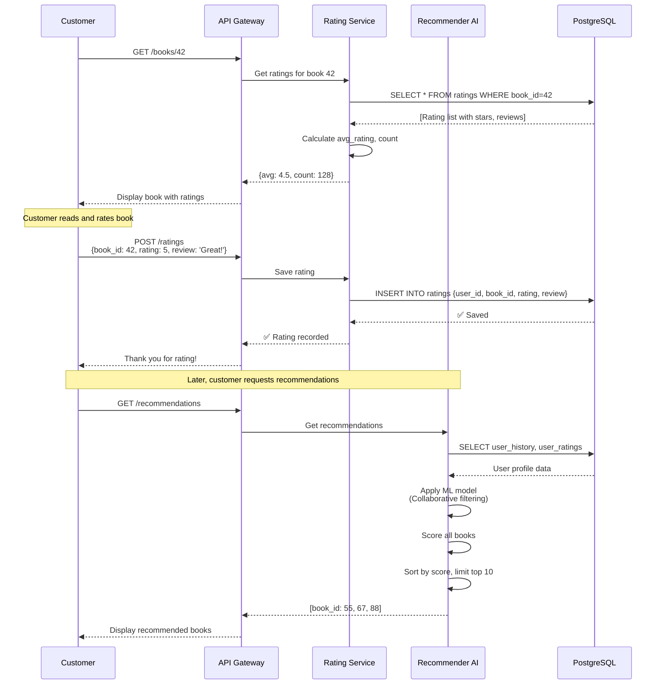
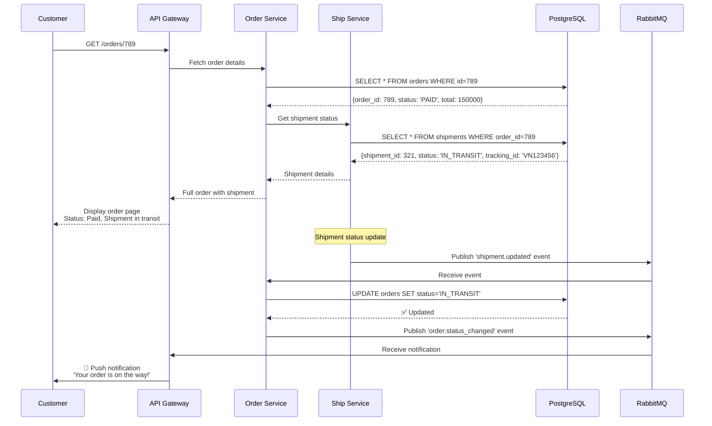
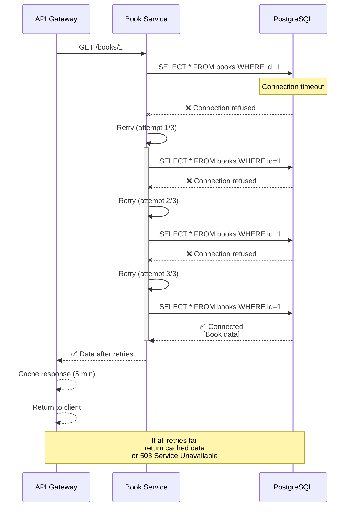
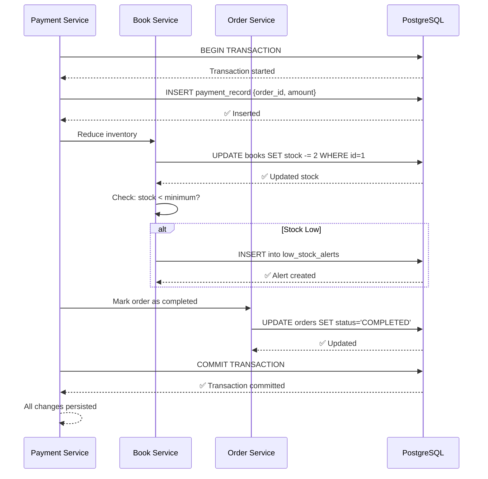
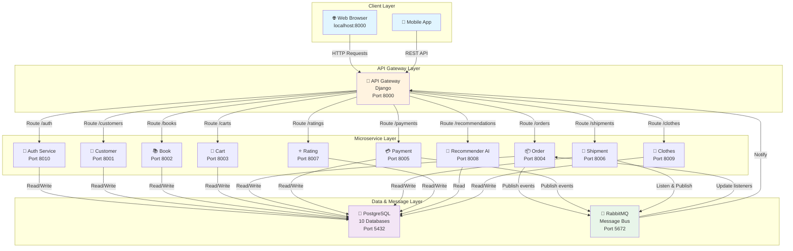

# Sequence Diagrams - BookStore Microservice Architecture

Generated for Phase 3 of verification (25/03 Morning)

---

## 1️⃣ FLOW: CUSTOMER REGISTRATION & LOGIN

### Diagram (Mermaid)



### Key Points
- **Auth Service** handles all authentication logic
- **JWT tokens** issued for stateless API calls
- **Database** stores hashed passwords (never plaintext)
- **API Gateway** relays requests and manages sessions

---

## 2️⃣ FLOW: BROWSE PRODUCTS & ADD TO CART

### Diagram (Mermaid)



### Key Points
- **Book Service** manages product catalog & inventory
- **Stock verification** prevents overselling
- **Cart Service** tracks user's shopping cart
- Each service owns its data store

---

## 3️⃣ FLOW: CHECKOUT & PAYMENT PROCESSING

### Diagram (Mermaid)



### Key Points
- **Order Service** owns order creation and status
- **Payment Service** integrates external payment gateways
- **Ship Service** handles logistics automatically after payment
- **Transactional integrity** - payment must complete before shipment
- **Database** spans multiple services (each owns their tables)

---

## 4️⃣ FLOW: PRODUCT RATING & RECOMMENDATIONS

### Diagram (Mermaid)



### Key Points
- **Rating Service** manages user reviews and ratings
- **Recommender AI** uses ML models for personalization
- **Collaborative filtering** uses similar users' ratings
- **Data aggregation** - AI service queries historical data for analysis

---

## 5️⃣ FLOW: ORDER STATUS TRACKING & NOTIFICATIONS

### Diagram (Mermaid)



### Key Points
- **Event-driven architecture** using RabbitMQ
- **Loose coupling** - services update via message bus
- **Pub/Sub pattern** - multiple services can listen to events
- **Real-time updates** - customers notified instantly

---

## 6️⃣ FLOW: ERROR HANDLING & RETRY LOGIC

### Diagram (Mermaid)



### Key Points
- **Exponential backoff** - retry with increasing delays
- **Circuit breaker pattern** - fail fast after 3 retries
- **Fallback cache** - serve stale data if service unavailable
- **Graceful degradation** - partial functionality maintained

---

## 7️⃣ FLOW: DATABASE TRANSACTION (ORDER + PAYMENT + INVENTORY)

### Diagram (Mermaid)



### Key Points
- **ACID transactions** - all or nothing
- **Coordination** - multiple services in single transaction
- **Inventory management** - stock updated atomically
- **Data consistency** - no orphaned orders or "phantom" stock"

---

## 8️⃣ ARCHITECTURE: OVERALL DATA FLOW

### Diagram (Mermaid)



### Key Points
- **Horizontal scaling** - each service can scale independently
- **Database per service** - data isolation and autonomy
- **Message bus** - asynchronous communication
- **Single gateway** - unified API entry point

---

## 🎯 MERMAID RENDERING GUIDE

### For Markdown Viewers (GitHub, GitLab)
The diagrams above are automatically rendered as you view this file.

### For Presentations (Powerpoint/Google Slides)
1. Go to: https://mermaid.live
2. Paste diagram code from above
3. Export as PNG/SVG
4. Insert into slides

### For Documentation (Confluence, Wiki)
Use Mermaid plugin for your platform:
- Confluence: `https://marketplace.atlassian.com/apps/1211988/mermaid-for-confluence`
- GitBook: Built-in support
- Notion: Paste code blocks with language `mermaid`

### For CI/CD Documentation
Include in your `.md` files with:
````markdown
```mermaid
sequenceDiagram
    ...your diagram code...
```
````

---

## 📚 USAGE IN PHASE 3

### Deliverables Checklist
- [x] **8 Sequence Diagrams** created (1-8 above)
- [x] **Architecture Overview** shown (#8)
- [x] **Error Handling** documented (#6)
- [x] **Transaction Flow** detailed (#7)
- [x] **Event-driven patterns** illustrated (#5)

### How to Present
1. **Monday/Tuesday Morning**: Show diagrams #1-4 (core flows)
2. **Tuesday Afternoon**: Show diagrams #5-7 (advanced patterns)
3. **Wednesday Morning**: Show diagram #8 (full architecture)
4. **Live Demo**: Run actual microservices and point to execution traces in diagrams

### Quick Reference
- **Customer journey**: #2 → #3 → #4
- **Backend coordination**: #5 → #6 → #7
- **System overview**: #8

---

**Document**: SEQUENCE_DIAGRAMS.md
**Created**: 23/03/2025
**For**: Phase 3 of Microservice Verification (25/03)
**Format**: Mermaid.js (compatible with GitHub, GitLab, Notion, Confluence)
**Status**: Ready for Presentation
